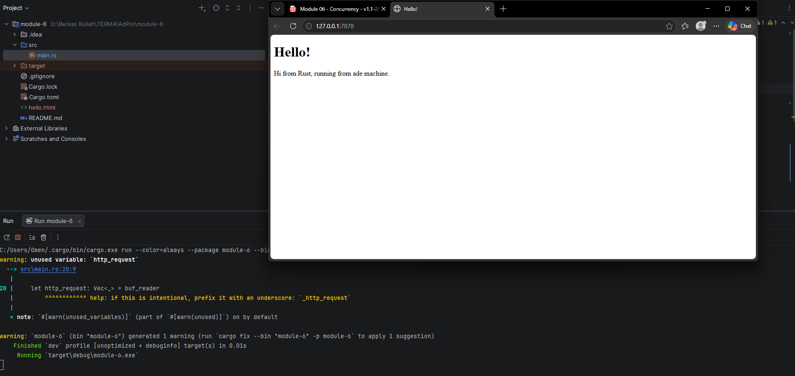
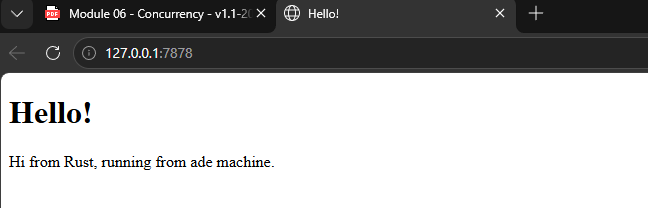
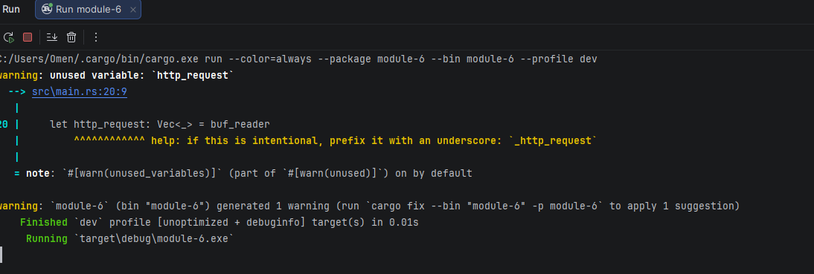
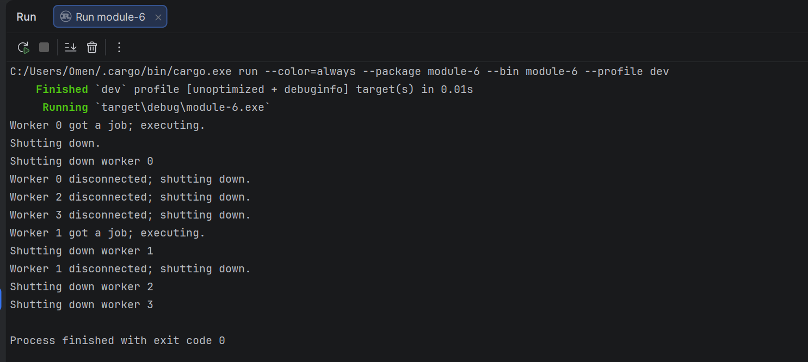

# Module-6---Concurrency

## Reflection 1
on handle_connection function 

the TCP stream is wrapped in a buffered render

then the http request is read by .lines()

then convert the Result enum into String

stored it into a vector,then print the requests line from the vector
 

based on the result the expected request contents seems to be more than the module tutorial given

it has a field named "sec-ch-ua/mobile/platform", "sec-fetch-site/mode/user/dest"

## Reflection 2

## Reflection 3

if and else blocks have a lot of repetition (status_line,contents,length,response)

the only thing making it different was the filename.

to refactor it we can assign values of status_name and filename to be variables

## Reflection 4
When opening http://127.0.0.1:7878/sleep (regardless of opening 2 or 1 webpage) ,there were 10 seconds of loading.
During the Pause did not continue the processing request immediately.

because there is a route calls of thread::sleep(Duration::from_secs(10));.

if there is a request of the /sleep page other pages will also get halted to wait for the
/sleep page to finish.
and also the handle_connection is called directly inside the loop, so the server process each connection sequentially.

this shows the limitation of a single thread web server. 
other users may experience delays because of the one user access a slow endpoint.

## Reflection 5
The main idea of the Lib.rs

ThreadPool: Owns multiple workers, owns a sender channel,and sends Jobs into the channel.

Workers: Owns a single thread, and waits for jobs from the shared receiver.

on pool.execute(||{task};)
the closure is boxed as Job, sent into the channel and one worker receives and executes it.

Arc is used for ownership transfer of the threads.

Mutex is for allowing only one thread is allowed to write data.

mpsc is used to send jobs from ThreadPool to workers.

on thread pool struct workers are stored on a vector.
and the sender is the input side of the job queue.

## Bonus
I used the "#[derive(Debug)]" call and create the Enum of named "PoolCreationError"

And then on the function call of build() the Return value is Result<ThreadPool, PoolCreationError> instead of the ThreadPool Only

On the Main.rs we need to unwrap the pool so that we can get the result from Error or ThreadPool,

The difference of this instead of a panic call is control flow.

if the Code panics it will Stop current execution, if its an Error call it will Return to the caller.

